<h1 align="center">Hi 👋, I'm Marco Guevara</h1>

<h3 align="center">Systems Engineer & Software Developer</h3>

  I'm a Systems Engineer and Software Developer passionate about building
  modern, scalable, and maintainable software.
   
  I work across the Full Stack, with a focus on Laravel, React, NestJS, and Next.js.
   
  I'm interested in software architecture, clean code, and continuously learning
  new technologies.

###

<h2 align="center">🚀 About Me</h2>

  💻 Full Stack Software Developer
   
  🎓 Systems Engineer
   
  🔧 Experienced in backend and frontend development
   
  🏗️ Interested in software architecture and clean code
   
  🐳 Docker enthusiast
   
  📚 Always learning and exploring new technologies

###

<h2 align="center">🛠️ Technologies & Tools</h2>

  
  

  
  

  
  

  
  

  
  

  
  

  
  

  
  

  
  

  
  

  
  

  

###

<h2 align="center">💼 Development Stack</h2>

| Area | Technologies |
|---|---|
| **Backend** | Laravel · NestJS · PHP · Node.js |
| **Frontend** | React · Next.js · TypeScript |
| **State Management** | Redux · Zustand |
| **Styling** | Tailwind CSS |
| **Databases** | MySQL · PostgreSQL |
| **DevOps** | Docker · Nginx |
| **Architecture** | REST APIs · Full Stack Applications · Clean Code |

###

<h2 align="center">📊 GitHub Stats</h2>

  

  

###

<h2 align="center">🐍 My Contributions</h2>

<picture>
  <source
    media="(prefers-color-scheme: dark)"
    srcset="./profile/pacman-dark.svg"
  />

  <source
    media="(prefers-color-scheme: light)"
    srcset="./profile/pacman.svg"
  />

  
</picture>

###

<h2 align="center">🌐 Connect With Me</h2>

  

###

  

